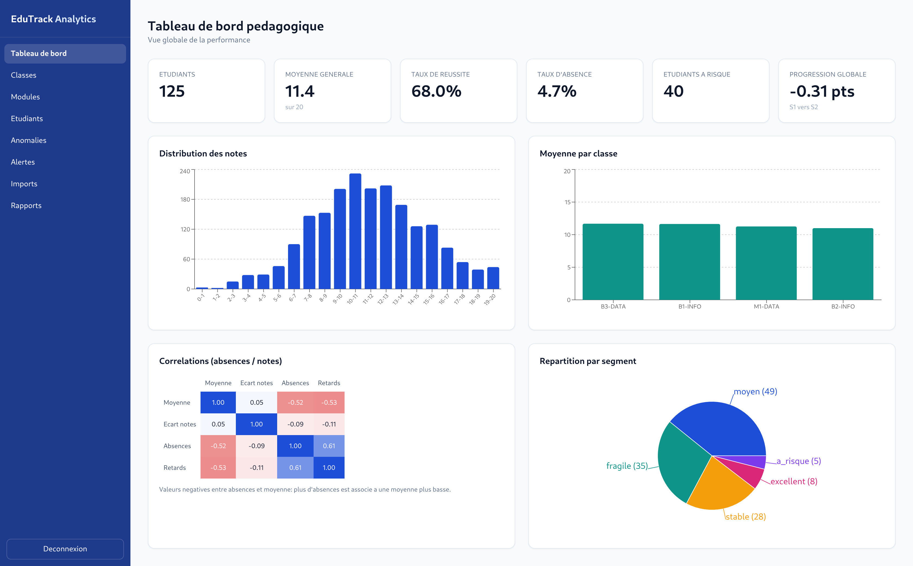
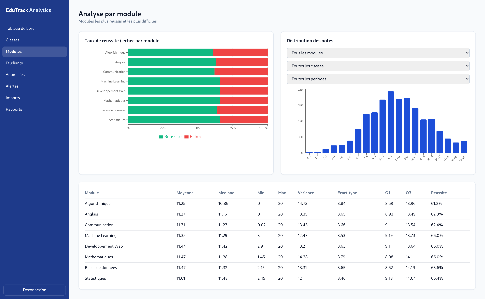
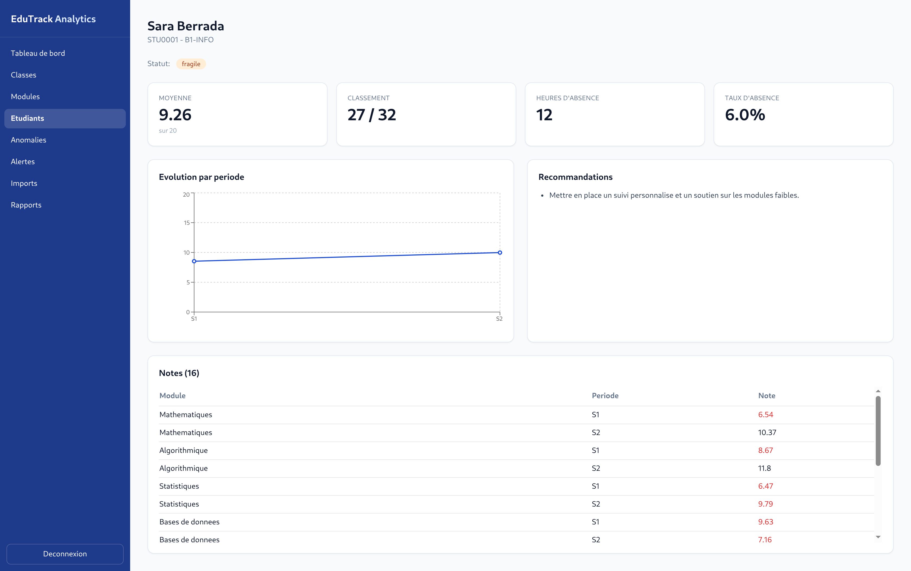
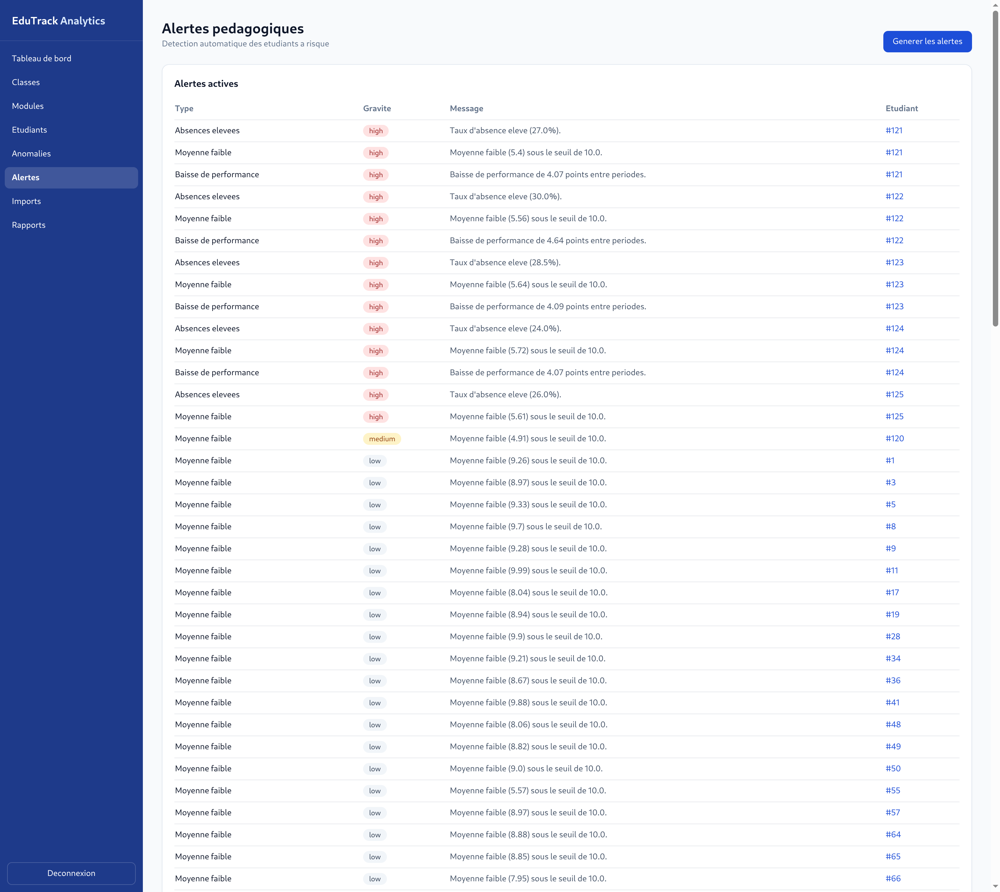
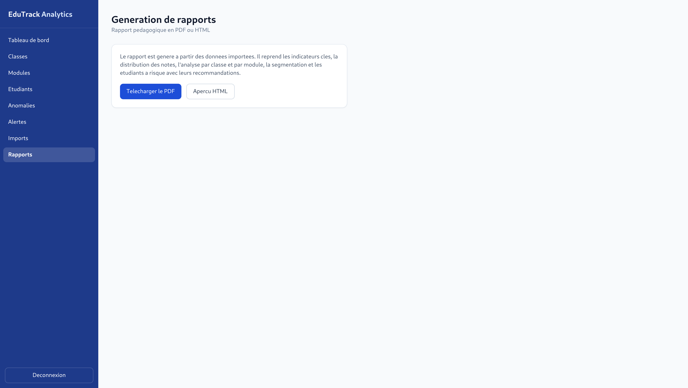
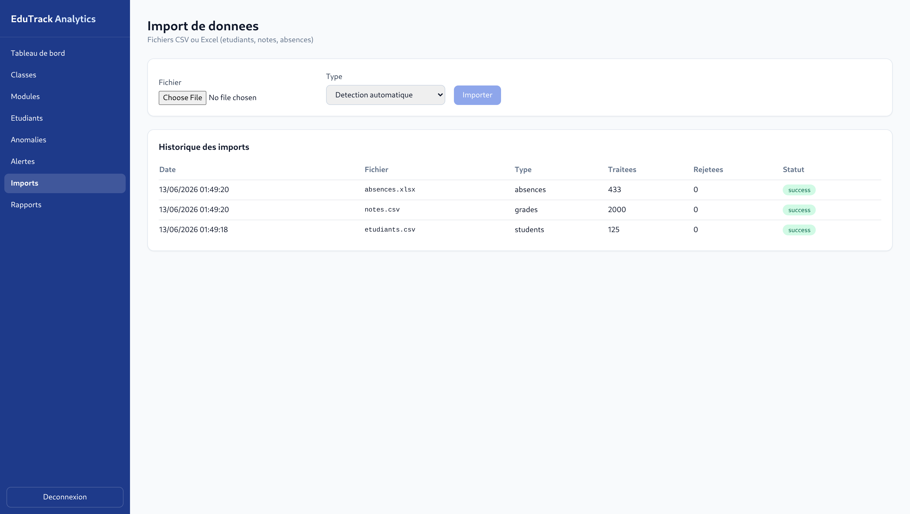

# Rapport technique : EduTrack Analytics

Projet Spé DATA, Maroc Ynov Campus.

## 1. Contexte et problématique

Un établissement génère beaucoup de données académiques (notes, absences, retards, modules,
classes) qui servent rarement à autre chose qu'au calcul des moyennes. EduTrack Analytics part
de ces données pour produire des indicateurs et des alertes utilisables par l'administration et
les formateurs.

La question de départ : comment repérer assez tôt les étudiants en difficulté et donner aux
responsables pédagogiques une vue claire de la performance, en se basant uniquement sur les
données académiques disponibles ?

La plateforme couvre toute la chaîne : import, nettoyage, analyse, visualisation, détection du
risque et génération de rapports.

## 2. Choix techniques

| Couche | Technologie | Justification |
|--------|-------------|---------------|
| Backend | FastAPI (Python) | Asynchrone, documentation OpenAPI automatique, s'intègre directement avec pandas |
| Données | pandas, NumPy | Manipulation des tableaux et calculs statistiques |
| Base de données | PostgreSQL | Base relationnelle, adaptée aux clés étrangères et à l'intégrité |
| ORM / migrations | SQLAlchemy, Alembic | Modèle déclaratif et migrations versionnées |
| Frontend | Next.js (React) + Tailwind | Tableau de bord réactif, composants de graphiques riches |
| Visualisation | Recharts, Matplotlib | Graphiques interactifs côté web, graphiques statiques pour le PDF |
| Authentification | JWT | Authentification sans état, simple à intégrer |
| Rapports | Jinja2 + WeasyPrint | Génération HTML puis conversion PDF |
| Déploiement | Docker Compose | Démarrage reproductible en une commande |

Python est le langage principal imposé par le cahier des charges. Il a aussi l'avantage de
réunir l'API et le traitement des données dans le même écosystème, donc pas besoin de jongler
entre plusieurs langages.

## 3. Architecture

Le code est découpé par responsabilité, comme demandé dans le cahier des charges. Les données
suivent toujours le même chemin : un fichier importé passe par le pipeline, est stocké dans
PostgreSQL, lu par la couche d'analyse, exposé par l'API, puis affiché dans le frontend.

| Couche | Contenu |
|--------|---------|
| Pipeline | reader, validator, cleaner, transformer, loader |
| Base PostgreSQL | students, classes, modules, grades, absences, imports, alerts, settings |
| Analyse | statistiques, corrélations, anomalies, score de risque, segmentation |
| API (FastAPI) | /auth, /imports, /analytics, /students, /alerts, /reports |
| Frontend (Next.js) | tableau de bord, visualisations, fiches étudiants, rapports |

Côté backend, chaque module a un rôle précis : `core` (configuration, base, sécurité),
`models` (schéma relationnel), `pipeline` (traitement des données), `analytics` (calculs),
`reports` (génération de rapports) et `api/routers` (endpoints).

## 4. Schéma de la base de données

Le modèle relationnel comprend neuf tables. Les relations sont protégées par des clés étrangères
pour garantir la cohérence entre étudiants, classes, modules et résultats.

- **users** : comptes d'accès (email, mot de passe haché, rôle)
- **classes** : groupes ou promotions
- **modules** : matières (code, nom, coefficient)
- **students** : étudiants, rattachés à une classe
- **grades** : notes, liées à un étudiant et un module
- **absences** : absences et retards, liés à un étudiant
- **imports** : historique des imports (fichier, lignes traitées, statut)
- **alerts** : alertes générées par étudiant
- **settings** : seuils pédagogiques configurables

Le script SQL complet est disponible dans `backend/schema.sql` et les migrations dans
`backend/alembic/`.

## 5. Pipeline de traitement des données

Le pipeline applique six étapes successives, orchestrées par `app/pipeline/runner.py` :

1. **Lecture** (`reader.py`) : lecture du CSV ou de l'Excel dans un DataFrame pandas.
2. **Normalisation** (`cleaner.normalize_columns`) : mise en forme des en-têtes et correspondance
   des alias français et anglais vers des noms canoniques.
3. **Validation** (`validator.py`) : vérification des colonnes obligatoires, des valeurs manquantes
   et des formats. Les erreurs bloquantes interrompent l'import.
4. **Nettoyage** (`cleaner.clean`) : suppression des doublons, conversion des types, traitement des
   valeurs nulles, suppression des notes hors de l'intervalle 0 à 20.
5. **Transformation / chargement** (`loader.py`) : résolution ou création des classes et modules,
   insertion des entités dans PostgreSQL au sein d'une transaction.
6. **Journalisation** : chaque import est enregistré dans la table `imports` avec le nombre de
   lignes traitées, rejetées et le statut.

Les fichiers de test dans `data/samples/edge_cases` contiennent volontairement des problèmes
(doublons, valeurs manquantes, notes hors borne, date invalide, colonne absente) pour vérifier
que le nettoyage et la validation réagissent bien.

## 6. Analyse exploratoire (EDA)

L'analyse exploratoire est détaillée dans le notebook `notebook/EDA.ipynb`. Principaux résultats :

- **Distribution des notes** : répartition centrée autour du seuil de validation, avec une part
  notable d'étudiants sous la moyenne.
- **Statistiques descriptives** : moyenne, médiane, écart-type et quartiles calculés par module et
  par classe, faisant ressortir les modules les plus difficiles.
- **Corrélations** : corrélation négative entre les heures d'absence et la moyenne, confirmant le
  lien entre assiduité et performance.
- **Anomalies** : détection des notes inhabituelles (z-score) et des absences excessives (IQR).

## 7. Tableau de bord et visualisations

Le tableau de bord présente au moins cinq visualisations interactives :

1. Histogramme de **distribution des notes**.
2. **Comparaison des classes** (moyenne par classe).
3. **Réussite / échec par module**.
4. **Heatmap de corrélation** (absences, retards, notes).
5. **Évolution par période** sur la fiche étudiant.
6. **Répartition par segment** (camembert des niveaux : excellent, stable, moyen, fragile, à risque).

*Tableau de bord : KPIs globaux, distribution des notes, moyenne par classe, corrélations et répartition par segment.*

*Analyse par module : taux de réussite et d'échec, distribution et statistiques descriptives.*

*Fiche individuelle : moyenne, classement, évolution par période et recommandations.*

## 8. Détection du risque et alertes

La détection des étudiants à risque repose sur des règles statistiques combinant trois signaux,
pondérés dans un score de risque de 0 à 100 (`app/analytics/risk.py`) :

- moyenne faible par rapport au seuil de validation ;
- taux d'absence élevé par rapport au volume horaire attendu ;
- baisse de performance entre la première et la dernière période.

Le score détermine un segment : *excellent, stable, moyen, fragile, à risque*. Des alertes
typées sont générées (moyenne faible, absences élevées, baisse de performance) avec un niveau de
gravité, et des recommandations pédagogiques concrètes sont proposées (suivi personnalisé, rappel
d'assiduité, point individuel).

*Alertes pédagogiques et recommandations par étudiant.*

## 9. Bonus C : génération automatique de rapports

Le module `app/reports/generator.py` produit un rapport pédagogique à partir des données
importées. Les graphiques sont générés avec Matplotlib et encodés dans le document, le rendu est
assuré par un gabarit Jinja2, puis converti en PDF avec WeasyPrint. Le rapport contient les KPIs,
la distribution des notes, la comparaison des classes, l'analyse par module, la segmentation et la
liste des étudiants à risque avec recommandations. Il est téléchargeable depuis l'application.

*Page de génération de rapports (PDF / HTML).*

## 10. Import des données

*Import de fichiers CSV / Excel avec rapport de validation et historique des imports.*

## 11. Tests et qualité

Le backend est couvert par des tests unitaires et d'intégration (`backend/tests/`) :
normalisation et nettoyage des colonnes, validation, scoring du risque, et un test d'intégration
complet de l'import. La commande `pytest` exécute l'ensemble de la suite.

## 12. Conclusion

Le projet répond aux demandes du cahier des charges : import et nettoyage des fichiers, base
relationnelle, tableau de bord avec plusieurs visualisations, détection du risque à partir des
données, segmentation des étudiants et génération de rapports (bonus C). Le découpage en modules
laisse de la place pour aller plus loin, par exemple un modèle prédictif du risque d'échec ou un
clustering K-Means.
